# 1.项目介绍
- 系统角色：管理员、普通用户
- 功能模块：管理员（宠物管理、领养管理、销售管理、系统管理、资讯管理等）、普通用户（注册登录、信息查询、购物车、宠物领养、资讯）
- 技术选型：SpringBoot，jsp等
- 测试环境：idea2024，mysql5.7，maven3，jdk1.8，navicat
# 2.项目部署
- 创建数据库，导入sql
- 通过idea打开项目，根据本地数据库环境配置src/main/resources/application.properties 4-7行
- 启动项目（src/main/java/com/boot/App.java）
- 管理web：http://localhost:8080/index.jsp  管理员账号密码：admin/123456
- 门户：http://localhost:8080/exit.jsp ，账号密码：user1/123456，或自行注册
# 3.项目部分截图
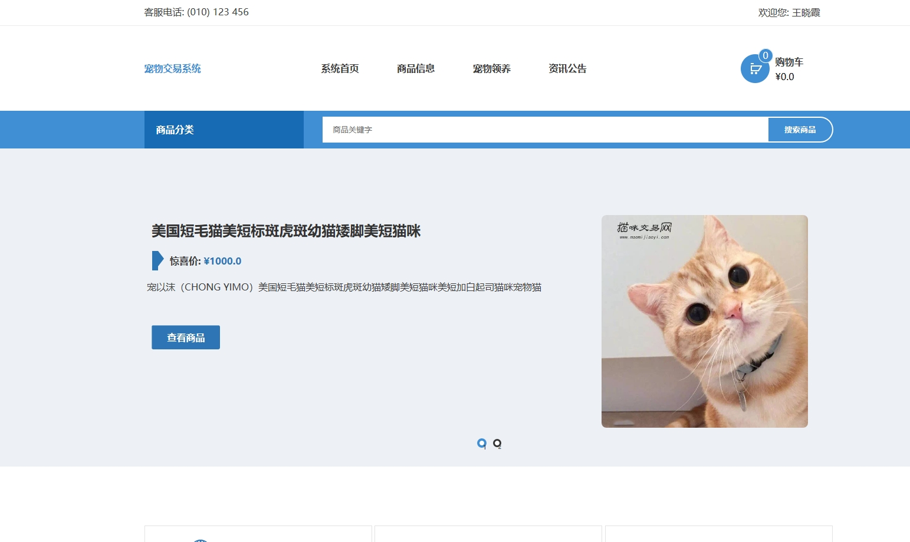
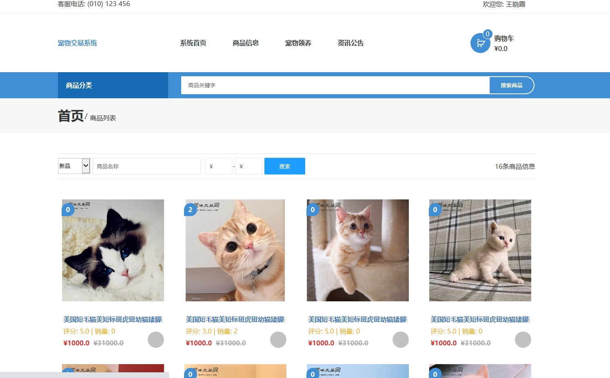
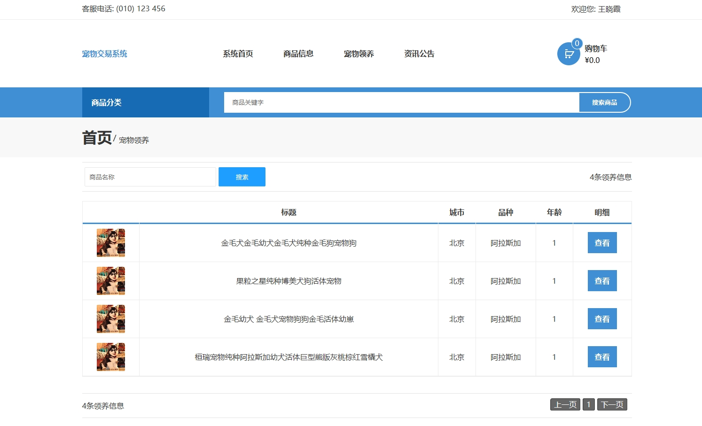
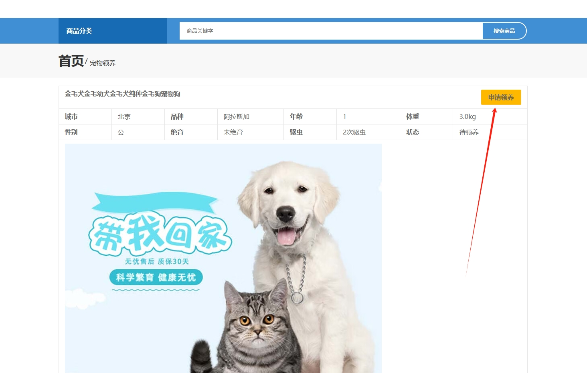

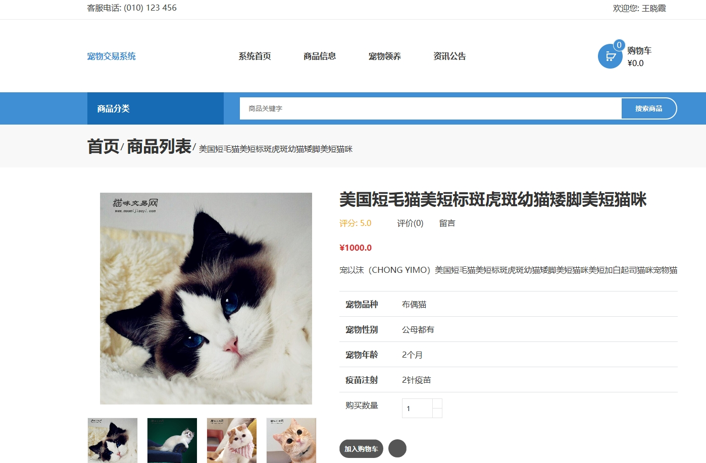
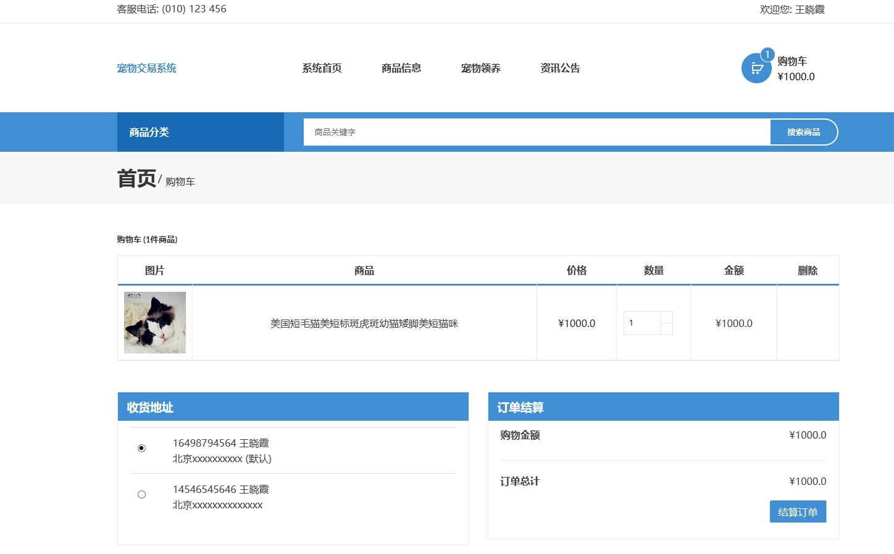
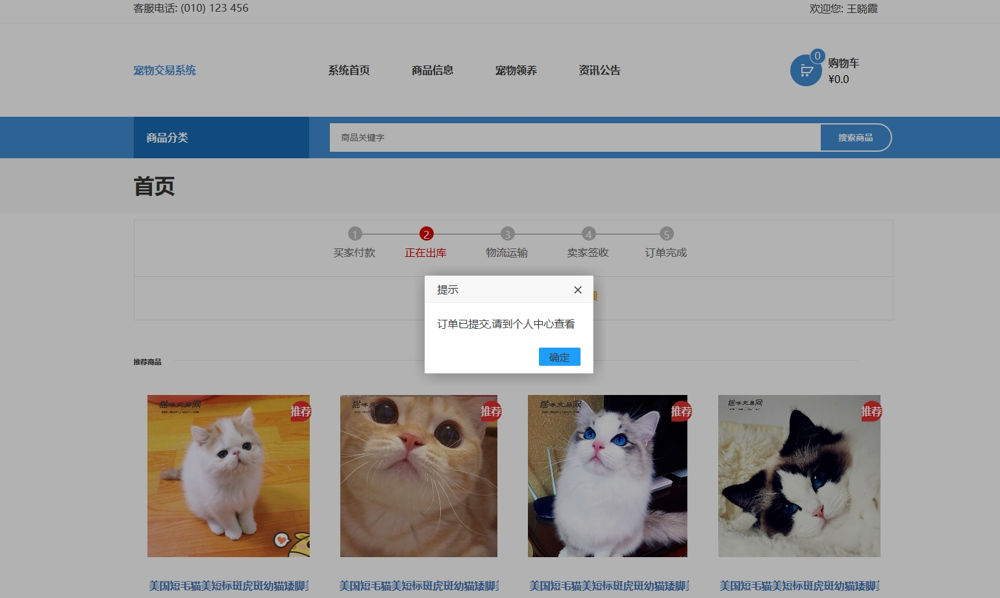
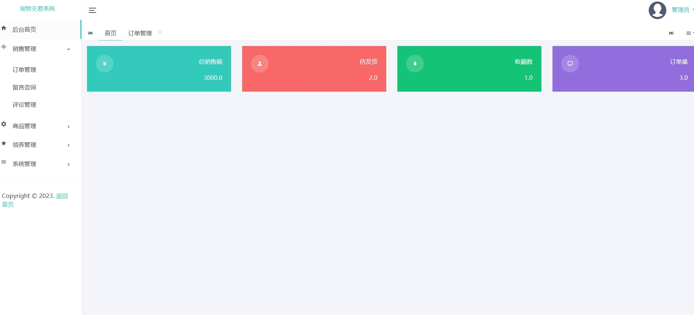
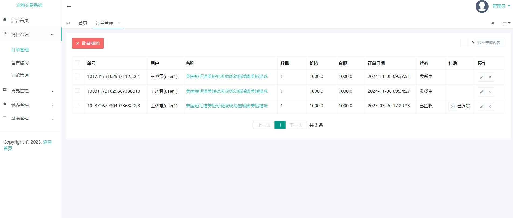
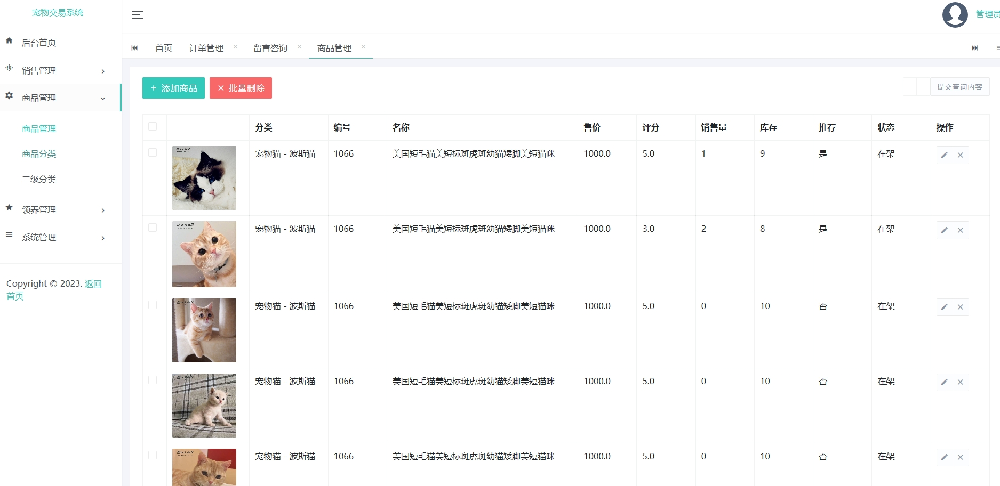
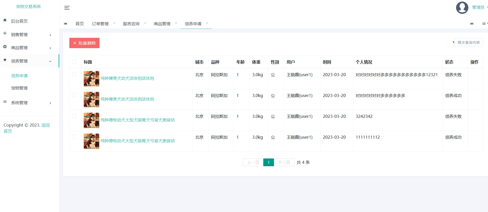
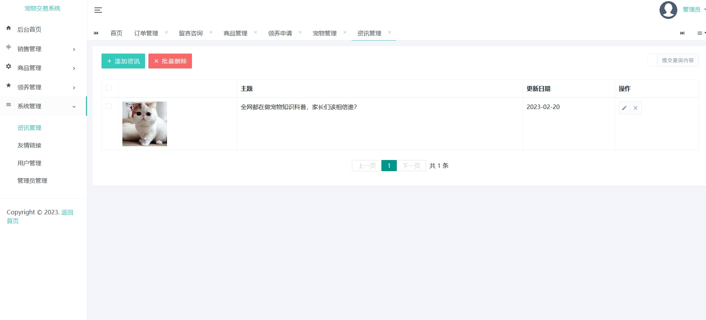
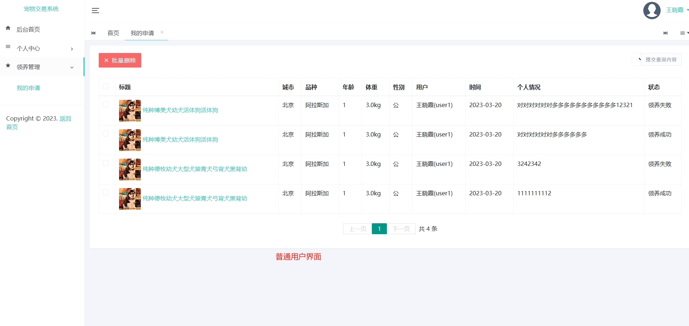
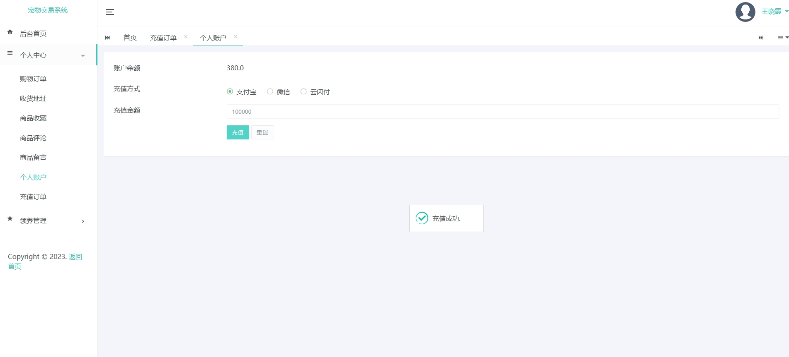
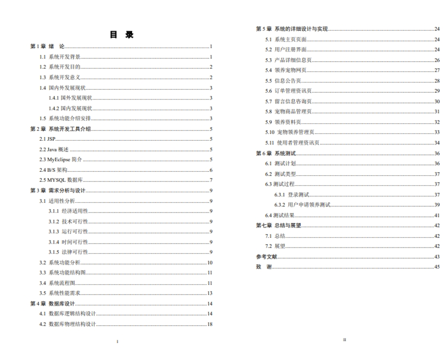

# 4.获取方式
[戳我查看](https://gitee.com/aven999/mall)